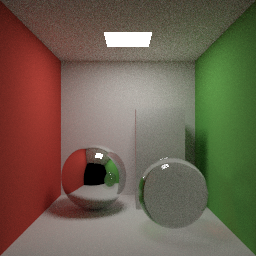

# Mithril

**Write plain scalar code. Mithril runs it in parallel on every CPU core and on
the GPU, and the result is the same no matter what order the work runs in.**

No threads, no locks, no annotations. Independent work in your program runs at
the same time on its own, and the answer is identical at 1 thread, 16 threads
or on the GPU.



This is `demos/cornell_path.py`, an ordinary recursive path tracer:

```python
def path(o, d, depth, h, seen):
    x = scene(o, d)
    if x[0] >= far() or depth == 0:
        return (0.0, 0.0, 0.0)
    ...
    direct = next_event(p, n, h)
    more = path(add(p, scale(n, eps())), bounce(n, hash(h + 4)), depth - 1, hash(h + 5), 0)
    return mul(albedo(m), add((direct, direct, direct), more))

def main():
    n = size()
    img = array_new(n * n, 0)
    for y in range(n):
        for x in range(n):
            img = array_set(img, y * n + x, pixel(x, y))
    return (n, n, img)
```

```
mithril run --image cornell.ppm demos/cornell_path.py --threads 1    # 1.60 s
mithril run --image cornell.ppm demos/cornell_path.py                # 0.17 s, 16 threads
mithril run --image cornell.ppm demos/cornell_path.py --gpu          # 0.27 s, RTX 4090
```

All three write the same image, bit for bit (times are run time, excluding
compilation).

## How it works

A Mithril program means a set of interaction-net rewrite rules. A rule only
ever touches two nodes, and two rules never touch the same node, so the rules
give the same result in any order: the runtime is free to run them in
parallel, and the compiler is free to run them early.

```
source (Python subset)  ->  Core  ->  net + rules  ->  residual  ->  LIR  ->  CPU: Rust + mithril-rt
mithril-front            oracle    compile-time     what input           GPU: CUDA + engine.cu
                                   reduction        still needs
```

- **The optimizer is the rules.** At compile time every rule that does not
  wait on input fires: constant folding, inlining, branch selection and dead
  code removal are rule firings, not separate passes (`mithril-net`).
- **What remains becomes native code.** Each function is emitted as plain
  native code where it can be, plus forms that can pause and split work
  across workers (`mithril-codegen`).
- **Parallel work comes from the program's shape.** Independent calls,
  proven folds and loops whose iterations are independent run as trees of
  tasks; the result is the sequential one.
- **One runtime model on both devices.** Tasks are pending rule firings,
  records wait for their inputs, dives run native code on a budget
  (`mithril-rt` on the CPU, `engine.cu` on the GPU).

`docs/guide.html` walks through this with pictures; `docs/design.md` is the
full design.

## Build

Requirements: Rust 1.86 or newer and Python 3 (for the test scripts).

```
cargo build --release -p mithril-cli                  # CPU only
cargo build --release -p mithril-cli --features gpu   # CPU and GPU
```

The binary is `target/release/mithril`. `mithril run` compiles the generated
program with `rustc`, so a Rust toolchain must be on the `PATH` when you run
programs too.

GPU support needs an NVIDIA GPU with a CUDA driver, Docker and the NVIDIA
Container Toolkit. The generated CUDA is compiled with `nvcc` inside a Docker
image (CUDA 13.0), so the host needs no CUDA toolkit. Build the image once:

```
docker build -f docker/nvcc.Dockerfile -t mithril-nvcc:cu13.0 docker/
```

`MITHRIL_NVCC_IMAGE` selects another image. Compiled kernels are cached under
`target/mithril-cache/gpu`.

## The language

- Functions (`def`), `if`/`elif`/`else`, `while`, `for i in range(a, b)`,
  `return`, assignment and tuple destructuring (`a, b = t`).
- Integers are 56-bit signed with wrap-around; floats are f64 by default.
  `sqrt(x)` and `f32(n)` make a value binary32, and f32 then spreads through
  the arithmetic; `int(x)` converts back.
- Algebraic data types with `@data`, taken apart with `match`/`case`
  (matches must be exhaustive), tuples and `t[i]` on them.
- Lambdas and closures (`lambda x: x + k`), passed and returned as values.
- Arrays as values: `array_new(n, v)`, `array_get(a, i)`, `array_set(a, i, v)`
  (returns the new array; updated in place when nothing else holds it),
  `array_len(a)`.
- No mutation of shared state, no locks, no annotations for parallelism.

## Examples

- `demos/cornell_whitted.py`, `demos/cornell_path.py`: a Whitted ray tracer
  and a path tracer of the Cornell box. Write the image with
  `mithril run --image cornell.ppm demos/cornell_path.py`.
- `bench/ports/*.py`: 17 benchmark programs (tree recursion, graph search,
  k-means, n-body, Mandelbrot, sorting networks, a lexer, a hash map, ...).
  Their expected checksums are in `bench/expected.txt`.
- `bench/general/*.py`: interpreters, persistent maps, pipelines and
  closures, the shapes a general-purpose language has to handle.
- `bench/lockless/`: five programs that need locks or atomics in C and Rust,
  written in Mithril without any, each with C and Rust versions.

## Tests

```
tests/ci/run.sh           # all CPU gates
tests/ci/run.sh --gpu     # plus the GPU gates
```

It runs, in order:

- `cargo test --release --workspace`: unit tests, and every program under
  `crates/*/tests/fixtures` compiled and checked against the reference
  interpreter at 1, 4 and 16 threads and under starved budgets.
- `tests/ci/fast.py`: every benchmark port at a small size (exact checksum
  at 1 and 16 threads) plus regression checks on generated-code size and
  instruction counts.
- `tests/parity/check.py`: 596 programs (fixtures, ports, demos and 500
  generated programs) run through the reference interpreter, 1/4/16
  threads, four starved budgets and the GPU, each compared with a pinned
  reference build (`tests/parity/build_ref.py`); `tests/parity/KNOWN.md`
  lists the reference's own known bugs.
- With `--gpu`: `tests/ci/gpu.py` (the ports on the device) and the device
  test suite.

Useful switches: `MITHRIL_STATS=1` (scheduler statistics of a CPU run),
`MITHRIL_TIMING=1` (compile and run times), `MITHRIL_GPU_STATS=1` and
`MITHRIL_GPU_TRACE=1` (per-round device statistics).

## Benchmarks

Big sizes of the benchmark ports and demos, wall-clock seconds, minimum of
3 runs after a warm-up. AMD Ryzen 7 7800X3D (8 cores, 16 threads), RTX 4090;
Mithril at commit `21e18d8` (`tests/parity/perf_baseline.json`), C twins
from `bench/results.md`. GPU times include CUDA context creation and
teardown (about 0.1 s). Every run prints the same checksum.

| program | C twin (gcc -O2, 1 thread) | Mithril 1 thread | Mithril 16 threads | Mithril GPU (wall) |
|---|---:|---:|---:|---:|
| bfs | 4.48 s | 4.87 s | 0.44 s | 0.43 s |
| cornell_path | - | 1.60 s | 0.17 s | 0.27 s |
| cornell_whitted | - | 0.22 s | 0.05 s | 0.52 s |
| editdist | 2.17 s | 2.26 s | 0.25 s | 0.35 s |
| gameoflife | 28.32 s | 8.59 s | 1.09 s | 0.13 s |
| hashmap | 0.77 s | 1.87 s | 0.23 s | 0.65 s |
| kdtree | 0.33 s | 0.41 s | 0.09 s | 1.34 s |
| kmeans | 10.16 s | 11.78 s | 1.48 s | 0.46 s |
| lexer | 1.03 s | 2.51 s | 0.34 s | 0.27 s |
| mandelbrot | 1.92 s | 3.95 s | 0.83 s | 0.19 s |
| merkle | 5.75 s | 5.39 s | 0.61 s | 0.15 s |
| nbody | - | 5.82 s | 0.51 s | 0.12 s |
| queens | 3.90 s | 4.81 s | 0.47 s | 1.33 s |
| raytrace | 9.03 s | 7.71 s | 0.85 s | 0.16 s |
| symreg | 3.01 s | 3.04 s | 0.40 s | 2.10 s |
| terrain | 4.12 s | 4.78 s | 0.56 s | 0.30 s |
| tree-bitonic | 8.50 s | 10.72 s | 1.57 s | 1.09 s |
| tree-matmul | 4.20 s | 4.04 s | 0.59 s | 0.57 s |
| tree-radix | 2.57 s | 4.20 s | 0.58 s | 0.66 s |

`bench/results.md` has the CPU table with C ratios, and `docs/design.md`
section 10 the comparison with reference.

## Limitations

Generated CPU code is mostly scalar: it targets baseline x86-64 (no AVX or
FMA), and independent calls such as pixels are not vectorized together.

## Repository layout

| path | contents |
|---|---|
| `crates/mithril-front` | lexer, parser, type elaboration, desugaring to Core, the reference interpreter |
| `crates/mithril-core` | ports, agents and the interaction rule table |
| `crates/mithril-net` | compile-time net reduction and specialization |
| `crates/mithril-reassoc` | detection and proof of associative folds |
| `crates/mithril-codegen` | lowering to the IR and the Rust printer |
| `crates/mithril-rt` | the CPU runtime (scheduler, workers, allocator) |
| `crates/mithril-gpu` | the CUDA printer, the device engine (`cuda/engine.cu`) and its host runner |
| `crates/mithril-cli` | the `mithril` command |
| `proofs/confluence` | Lean 4 proof that the core rule table is confluent |
| `bench`, `demos`, `tests` | programs, benchmarks and gates |

## License

Apache License 2.0, see `LICENSE`. Parts of `bench/` are derived from
reference's benchmarks (Apache-2.0); see `NOTICE`.
