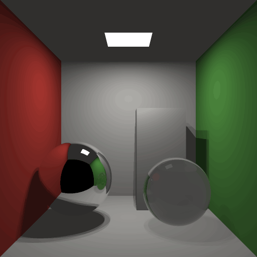

# Mithril

**A programming language for deterministic parallelism, built on interaction nets.**

Write ordinary step-by-step code. Mithril runs it on every core of a CPU or
across a GPU, and the answer is the same whichever order the work runs in. There
are no threads, locks or parallel annotations in the source.

**Read the introduction:
[Mithril: a programming language for deterministic parallelism](https://maderix.github.io/articles/mithril/)**,
an illustrated article covering where the language comes from, how it works,
animated examples, where it fits and where it does not.

| Whitted ray tracing | Path tracing |
|---|---|
|  |  |
| 512×512 · 4 samples per pixel | 256×256 · 64 samples per pixel |

Both scenes are plain Mithril programs. The same source runs on 1 thread, 16
threads and an NVIDIA GPU, and all three write identical pixels.
[Measurements and reproduction](docs/img/raytracer-animation.md).

```python
def main():
    n = size()
    img = array_new(n * n, 0)
    for y in range(n):
        for x in range(n):
            img = array_set(img, y * n + x, pixel(x, y))
    return (n, n, img)
```

```
mithril run --image cornell.ppm demos/cornell_path.py --threads 1
mithril run --image cornell.ppm demos/cornell_path.py --threads 16
mithril run --image cornell.ppm demos/cornell_path.py --gpu
```

## How it works

A Mithril program means what a set of interaction-net rewrite rules says it
means. Each rule replaces one pair of connected nodes and touches no other node,
so any two rule firings can happen in either order and the result is the same.
The runtime can therefore run them in parallel, and the compiler can run them
early.

```
source (Python subset)  ->  Core  ->  net + rules  ->  residual  ->  LIR  ->  CPU: Rust + mithril-rt
mithril-front            oracle    compile-time     the program          GPU: CUDA + engine.cu
                                   reduction        that runs
```

- **The optimizer is the rules.** While compiling, Mithril fires every rule
  whose inputs are written in the source. Constant folding, inlining and branch
  selection are rule firings, so they cannot change what the program means
  (`mithril-net`).
- **Input-dependent work becomes native code.** A function that is one sequence
  of steps, such as the arithmetic for a pixel, is emitted as plain machine
  code. A function that can split into independent calls also gets a form that
  can pause and hand work to idle cores (`mithril-codegen`).
- **Parallel work comes from the program's shape.** Independent calls, proven
  folds and loops whose iterations do not depend on each other run as trees of
  tasks, and the result equals the one-thread result.
- **One runtime model on both devices.** Tasks are pending rule firings, records
  wait for their inputs, and dives run native code under a work budget
  (`mithril-rt` on the CPU, `engine.cu` on the GPU).

[docs/design.md](docs/design.md) records the full design and its open
obligations.

## What is proved

- **The order of rule firings cannot change the result.** For Mithril's core
  rules, if one order of firings reaches a final net, every order reaches the
  same net in the same number of steps, and stopping part-way (as the compiler
  does when its budget runs out) is safe. Machine-checked in Lean 4:
  [proofs/confluence](proofs/confluence/README.md). It does not prove that a
  program finishes, and it does not cover the extra rules the implementation
  adds; tests check those.
- **Splitting a loop into chunks gives the same total.** Before a loop such as
  `total = total + steps(i)` is split across cores, the compiler proves that
  the operation is associative with an identity, and Lean checks the proof
  (`mithril prove`). Floating-point sums are never split.
- **The CPU runtime's lock-free handoffs have no races.** The protocol
  functions are model-checked with loom under every thread interleaving: a join
  fires once with all its inputs, and a shared value is freed once, after its
  last reader.

The compiler, the extra rules and both runtimes are checked by comparing
compiled programs with a reference interpreter at several thread counts, with
starved work budgets, and on the GPU (see Tests).

## The language

- Functions (`def`), `if`/`elif`/`else`, `while`, `for i in range(a, b)`,
  `return`, assignment and tuple destructuring (`a, b = t`).
- Integers are 56-bit signed with wrap-around; floats are f64 by default.
  `sqrt(x)` and `f32(n)` make a value binary32, and f32 then spreads through
  the arithmetic; `int(x)` converts back.
- Algebraic data types with `@data`, taken apart with `match`/`case`
  (matches must be exhaustive), tuples and `t[i]` on them.
- Lambdas and closures (`lambda x: x + k`), passed and returned as values.
- Arrays as values: `array_new(n, v)`, `array_get(a, i)`, `array_set(a, i, v)`
  (returns the new array; written in place when no other variable refers to
  the old one), `array_len(a)`.
- No shared mutable state, no locks, no parallel annotations.

## Build

Requirements: Rust 1.86 or newer and Python 3 (for the test scripts).

```
cargo build --release -p mithril-cli                  # CPU only
cargo build --release -p mithril-cli --features gpu   # CPU and GPU
```

The binary is `target/release/mithril`. `mithril run` compiles the generated
program with `rustc`, so a Rust toolchain must be on the `PATH` when you run
programs too.

GPU support needs an NVIDIA GPU with a CUDA driver, Docker and the NVIDIA
Container Toolkit. The generated CUDA is compiled with `nvcc` inside a Docker
image (CUDA 13.0), so the host needs no CUDA toolkit. Build the image once:

```
docker build -f docker/nvcc.Dockerfile -t mithril-nvcc:cu13.0 docker/
```

`MITHRIL_NVCC_IMAGE` selects another image. Compiled kernels are cached under
`target/mithril-cache/gpu`.

## Examples

- `demos/cornell_whitted.py`, `demos/cornell_path.py`: a Whitted ray tracer and
  a path tracer of the Cornell box. Write the image with
  `mithril run --image cornell.ppm demos/cornell_path.py`.
- `docs/examples/`: the merge sort, N-queens, Collatz and specialization
  programs used in the introduction.
- `bench/ports/kdtree.py`: nearest-neighbour queries over a shared spatial tree,
  with an independent C implementation and a recorded checksum.
- `bench/general/*.py`: interpreters, persistent maps, pipelines and closures.
- `bench/lockless/`: five programs that need locks or atomics in C and Rust,
  written in Mithril without either, each with C and Rust versions.

Inspect what the compiler did with a program:

```
mithril net f.py      # rule firings and the residual size per function
mithril prove f.py    # fold proofs, checked by Lean
mithril oracle f.py   # the reference interpreter's answer
```

## Tests

```
tests/ci/run.sh           # all CPU gates
tests/ci/run.sh --gpu     # plus the GPU gates
```

It runs, in order:

- `cargo test --release --workspace`: unit tests, and every program under
  `crates/*/tests/fixtures` compiled and checked against the reference
  interpreter at 1, 4 and 16 threads and under starved budgets.
- `tests/ci/fast.py`: the spatial-tree benchmark at a small size (exact checksum
  at 1 and 16 threads) plus regression checks on generated-code size and
  instruction counts.
- `tests/parity/check.py`: fixtures, benchmarks, demos and generated programs run
  through the reference interpreter, 1/4/16 threads, starved budgets and the
  GPU, each compared with a pinned reference build.
- With `--gpu`: `tests/ci/gpu.py` (the ports on the device) and the device test
  suite.

Useful switches: `MITHRIL_STATS=1` (scheduler statistics of a CPU run),
`MITHRIL_TIMING=1` (compile and run times), `MITHRIL_GPU_STATS=1` and
`MITHRIL_GPU_TRACE=1` (per-round device statistics).

## Results

Recorded wall-clock seconds, compilation excluded. Ryzen 7 7800X3D
(8 cores, 16 threads), RTX 4090. Render timings are medians of three runs on
2 October 2026; GPU wall includes context creation and readback. The
spatial-tree CPU measurements are from 29 September and its GPU measurement
from 2 October. Every lane produces the same output.

| program | C (1 thread) | Mithril 1 thread | Mithril 16 threads | Mithril GPU (wall) |
|---|---:|---:|---:|---:|
| cornell_path | - | 2.149 s | 0.238 s | 0.335 s |
| cornell_whitted | - | 0.264 s | 0.061 s | 0.871 s |
| kdtree | 0.333 s | 0.406 s | 0.090 s | 1.280 s |

[Spatial-tree methods](bench/results.md) ·
[Render measurements](docs/img/raytracer-static.json).

## Repository layout

| path | contents |
|---|---|
| `crates/mithril-front` | lexer, parser, type elaboration, desugaring to Core, the reference interpreter |
| `crates/mithril-core` | ports, agents and the interaction rule table |
| `crates/mithril-net` | compile-time net reduction and specialization |
| `crates/mithril-reassoc` | detection and proof of associative folds |
| `crates/mithril-codegen` | lowering to the IR and the Rust printer |
| `crates/mithril-rt` | the CPU runtime (scheduler, workers, allocator) |
| `crates/mithril-gpu` | the CUDA printer, the device engine (`cuda/engine.cu`) and its host runner |
| `crates/mithril-cli` | the `mithril` command |
| `proofs/confluence` | Lean 4 proof that the core rule table is confluent |
| `bench`, `demos`, `docs`, `tests` | programs, benchmarks, documentation and gates |

## License

Apache License 2.0, see `LICENSE`.
