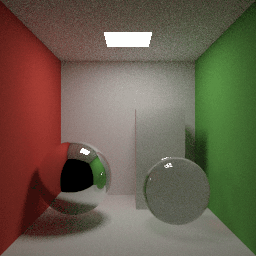

# Mithril

**A programming language for deterministic parallelism, built on interaction nets.**

Write ordinary step-by-step code: functions, loops, values. Mithril finds the
calls that can run at the same time and runs them on every core of a CPU or
across a GPU. The answer is the same whichever order the work runs in.

**Read the introduction:
[Mithril: a programming language for deterministic parallelism](https://maderix.github.io/articles/mithril/)**,
an illustrated article covering where the language comes from, how it works,
animated examples, good uses and current limits.

| Spinning black hole | Path tracing |
|---|---|
|  |  |
| 1280×720 · Kerr light rays | 256×256 · 64 samples per pixel |

The black hole follows each pixel's light backward through the spacetime of a
hole spinning at 0.99 of the maximum, as a camera descends from 26 to 6
gravitational radii. The lensed disk, its Doppler and gravitational colour
shifts, the stars crowding toward the direction of travel: all of it comes
from the equations of the rays, in single precision.
[Source](demos/black_hole.py) · [measurements](docs/img/black_hole.md).

Both scenes are plain Mithril programs. The same source runs on 1 thread, 16
threads and an NVIDIA GPU, and all three write identical pixels.
[Measurements and reproduction](docs/img/raytracer-animation.md).

```python
def main():
    n = size()
    img = array_new(n * n, 0)
    for y in range(n):
        for x in range(n):
            img = array_set(img, y * n + x, pixel(x, y))
    return (n, n, img)
```

```
mithril run --image cornell.ppm demos/cornell_path.py --threads 1
mithril run --image cornell.ppm demos/cornell_path.py --threads 16
mithril run --image cornell.ppm demos/cornell_path.py --gpu
```

## Quickstart

Build the compiler (Rust 1.86 or newer):

```
git clone https://github.com/maderix/mithril && cd mithril
cargo build --release -p mithril-cli
```

Write a program. It is Python: functions, loops, `if`, tuples, arrays.
`main()` returns the answer.

```python
# first.py
def collatz(n):
    """Steps for n to reach 1."""
    steps = 0
    while n != 1:
        n = n // 2 if n % 2 == 0 else 3 * n + 1
        steps += 1
    return steps


def main():
    total = 0
    for i in range(1, 3000000):
        total += collatz(i)
    return total
```

Run it:

```
target/release/mithril run first.py --threads 16  # sixteen threads
target/release/mithril run first.py --threads 1   # one thread (the default)
```

Both print `428343355`, the value CPython's `main()` returns. Nothing in the
program names a thread: the loop's iterations are independent and the sum
is associative, so Mithril splits the loop across the threads (0.28 s on one,
0.02 s on sixteen). `mithril build first.py -o first` writes an executable
(`./first --threads 16`); `mithril oracle first.py` runs the slow reference
interpreter that every backend is checked against, best kept to small
inputs; `mithril --help` lists the commands. With an NVIDIA GPU, build the
CLI with `--features gpu` (see [Build](#build)) and add `--gpu`.

The language is a subset of Python: integers (64-bit), floats, `f32`,
tuples, arrays (`array_new`, `array_get`, `array_set`, `array_len`), `@data`
classes with `match`, lambdas and closures. Values never change in place, so
an array update returns the new array: `a = array_set(a, i, v)`. See
[The language](#the-language) and the [field guide](docs/guide.html).

## How it works

A Mithril program means what a set of interaction-net rewrite rules says it
means. Each rule replaces one pair of connected nodes and changes only those two
nodes and their wires, so two rule firings can happen in either order and the
result is the same.
The runtime can therefore run them in parallel, and the compiler can run them
early.


The rules that need only what the source says fire while compiling; the ones
that need the program's input fire when it runs, many at once:


- **The optimizer is the rules.** While compiling, Mithril fires every rule
  whose inputs are written in the source. Constant folding, inlining and branch
  selection are rule firings, so the optimized program computes exactly what the
  source computes (`mithril-net`).
- **Work that needs input data becomes native code.** A function that is one sequence
  of steps, such as the arithmetic for a pixel, is emitted as plain machine
  code. A function that can split into independent calls also gets a form that
  can pause and hand work to idle cores (`mithril-codegen`).
- **Parallel work comes from the program's shape.** Two calls with separate
  inputs, a loop that sums with a proven operation, and a loop where each
  iteration uses only its own index and shared read-only data all run as trees
  of tasks, and the result equals the one-thread result.
- **One runtime model on both devices.** Tasks are pending rule firings, records
  wait for their inputs, and dives run native code under a work budget
  (`mithril-rt` on the CPU, `engine.cu` on the GPU).

[docs/design.md](docs/design.md) records the full design and its open
obligations.

## What is proved

- **Every order of rule firings gives the same result.** For Mithril's core
  rules, if one order of firings reaches a final net, every order reaches the
  same net in the same number of steps. A half-reduced program, which the
  compiler leaves when its work budget runs out, still reaches that same net.
  Machine-checked in Lean 4: [proofs/confluence](proofs/confluence/README.md).
  Scope: the proof assumes the program finishes and covers the core rules
  (erasing, copying, function application, arithmetic, branching, pattern
  matching and calls). The proof says the answer is independent of order. Tests
  against a reference interpreter say it is the right answer, and they also
  cover the rules the implementation adds (copying a closure, unfolding a call
  whose arguments are still unknown) and the Rust and CUDA code.
- **Loops are split only with an associative operation.** Before a loop such as
  `total = total + steps(i)` is split across cores, the compiler proves that
  the operation is associative with an identity, and Lean checks the proof
  (`mithril prove`). Those two facts are what make the chunks combine to the
  loop's own answer; that last step is standard algebra, not machine-checked. Integer sums qualify. Floating-point sums run as one
  sequential loop, because their rounding depends on how the terms are grouped.
- **The CPU runtime's lock-free handoffs are correct under every
  interleaving.** The protocol functions are model-checked with loom: in every
  thread schedule, a join fires exactly once with all its inputs, and a shared
  value is freed exactly once, after its last reader.

The compiler, the extra rules and both runtimes are checked by comparing
compiled programs with a reference interpreter at several thread counts, with
tiny work budgets that force pausing, and on the GPU (see Tests).

## The language

- Functions (`def`), `if`/`elif`/`else`, `while`, `for i in range(a, b)`,
  `return`, assignment and tuple destructuring (`a, b = t`).
- Integers are 64-bit signed with wrap-around; floats are f64 by default.
  `sqrt(x)` and `f32(n)` make a value binary32, and f32 then spreads through
  the arithmetic; `int(x)` converts back.
- Algebraic data types with `@data`, taken apart with `match`/`case`
  (matches must be exhaustive), tuples and `t[i]` on them.
- Lambdas and closures (`lambda x: x + k`), passed and returned as values.
- Arrays as values: `array_new(n, v)`, `array_get(a, i)`, `array_set(a, i, v)`
  (returns the new array; written in place when the old array has a single
  owner), `array_len(a)`.
- Values only: updating an array or a tuple produces a new one, and the
  parallelism comes from the program's dependencies.
- Also: `break`, `continue`, `return` inside loops, chained comparisons,
  `x += e`, `**`, `range(a, b, step)`, `min`/`max`/`abs`, module-level
  constants. `main()` takes no arguments; booleans print as 1 and 0.

Not in the language yet, with what to write instead:

| Python | Mithril today |
|---|---|
| `print`, strings, f-strings | return the value from `main()` |
| lists, `append`, comprehensions, dicts, sets | arrays: `array_new`, `array_set`, `array_get`; `@data` lists |
| `for x in xs`, `enumerate`, `zip`, `len`, `sum` | `for i in range(array_len(a))` |
| `float(n)`, `round`, mixing ints and floats, `/` on ints | keep a computation in floats or in `f32`; `//` for integers |
| default and keyword arguments, `*args`, nested `def`, classes | top-level functions, lambdas, `@data` |
| `None`, `is`, `in`, `case _`, type hints, `import`, `try` | `@data` variants and `match` with every case listed |

Known issues in this release: after `for i in range(n)`, `i` keeps its value
from before the loop (write `range(0, n)` when you read `i` afterwards); an f32 returned from `main()` prints as its
bit pattern; mixing an int and an f64 in one operation stops with an internal
error instead of a type error; errors after parsing report the line of the
enclosing `def`.

## Build

Requirements: Rust 1.86 or newer and Python 3 (for the test scripts). The CPU
backend runs on Linux x86-64 and, experimentally, on macOS with Apple silicon
(fast CI and the demo suite pass there with the same values as on Linux); the
GPU backend needs Linux and an NVIDIA GPU.

```
cargo build --release -p mithril-cli                  # CPU only
cargo build --release -p mithril-cli --features gpu   # CPU and GPU
```

The binary is `target/release/mithril`. `mithril run` compiles the generated
program with `rustc`, so a Rust toolchain must be on the `PATH` when you run
programs too.

GPU support needs an NVIDIA GPU with a CUDA driver, Docker and the NVIDIA
Container Toolkit. The generated CUDA is compiled with `nvcc` inside a Docker
image (CUDA 13.0), so the host only needs the driver and Docker. Build the image
once:

```
docker build -f docker/nvcc.Dockerfile -t mithril-nvcc:cu13.0 docker/
```

`MITHRIL_NVCC_IMAGE` selects another image. Compiled kernels are cached under
`target/mithril-cache/gpu`.

## Examples

- `demos/black_hole.py`: a spinning black hole seen from a descending camera,
  rendered by tracing light rays through the Kerr spacetime. Write a strip of
  40 frames with `mithril run --image hole.ppm demos/black_hole.py --gpu`.
- `demos/cornell_whitted.py`, `demos/cornell_path.py`: a Whitted ray tracer and
  a path tracer of the Cornell box. Write the image with
  `mithril run --image cornell.ppm demos/cornell_path.py`.
- `docs/examples/`: the merge sort, N-queens, Collatz and specialization
  programs used in the introduction.
- `bench/ports/kdtree.py`: nearest-neighbour queries over a shared spatial tree,
  with an independent C implementation and a recorded checksum.
- `bench/general/*.py`: interpreters, persistent maps, pipelines and closures.
- `bench/lockless/`: five programs that use locks or atomics in C and Rust,
  written in Mithril with plain values, each next to its C and Rust versions.

Inspect what the compiler did with a program:

```
mithril net f.py      # rule firings and the residual size per function
mithril prove f.py    # fold proofs, checked by Lean
mithril oracle f.py   # the reference interpreter's answer
```

## Tests

```
tests/ci/run.sh           # all CPU gates
tests/ci/run.sh --gpu     # plus the GPU gates
```

It runs, in order:

- `cargo test --release --workspace`: unit tests, and every program under
  `crates/*/tests/fixtures` compiled and checked against the reference
  interpreter at 1, 4 and 16 threads and with tiny work budgets that force
  pausing.
- `tests/ci/fast.py`: the spatial-tree benchmark at a small size (exact checksum
  at 1 and 16 threads) plus regression checks on generated-code size and
  instruction counts.
- `tests/parity/check.py`: fixtures, benchmarks, demos and generated programs run
  through the reference interpreter, 1/4/16 threads, tiny work budgets and the
  GPU, each compared with a pinned reference build.
- With `--gpu`: `tests/ci/gpu.py` (the ports on the device) and the device test
  suite.

Useful switches: `MITHRIL_STATS=1` (scheduler statistics of a CPU run),
`MITHRIL_TIMING=1` (compile and run times), `MITHRIL_GPU_STATS=1` and
`MITHRIL_GPU_TRACE=1` (per-round device statistics).

## Results

Recorded wall-clock seconds, compilation excluded. Ryzen 7 7800X3D
(8 cores, 16 threads), RTX 4090. Render timings are medians of three runs on
2 October 2026; GPU wall includes context creation and readback. The
spatial-tree CPU measurements are from 29 September and its GPU measurement
from 2 October. Every lane produces the same output.

| program | C (1 thread) | Mithril 1 thread | Mithril 16 threads | Mithril GPU (wall) |
|---|---:|---:|---:|---:|
| cornell_path | - | 2.149 s | 0.238 s | 0.335 s |
| cornell_whitted | - | 0.264 s | 0.061 s | 0.871 s |
| kdtree | 0.333 s | 0.406 s | 0.090 s | 1.280 s |

[Spatial-tree methods](bench/results.md) ·
[Render measurements](docs/img/raytracer-static.json).

### Against Bend 2 on the GPU

Process wall time on an RTX 4090, 2 October 2026: the binaries Bend 2.0.31's own
compiler produced, against Mithril. Minimum of three alternating runs, machine
load below 2, builds excluded; all 96 timed and 32 warm-up runs give matching
checksums. A ratio below 1 means Mithril is faster.

| program | Bend 2 | Mithril | Mithril / Bend 2 |
|---|---:|---:|---:|
| bfs | 222.20 ms | 422.15 ms | 1.900 |
| editdist | 239.32 ms | 340.21 ms | 1.422 |
| gameoflife | 86.17 ms | 115.77 ms | 1.344 |
| hashmap | 669.17 ms | 700.99 ms | 1.048 |
| kmeans | 304.18 ms | 441.57 ms | 1.452 |
| lexer | 355.60 ms | 258.90 ms | **0.728** |
| mandelbrot | 93.76 ms | 177.72 ms | 1.896 |
| merkle | 103.18 ms | 127.57 ms | 1.236 |
| nbody | 85.15 ms | 102.48 ms | 1.204 |
| queens | 799.92 ms | 110.87 ms | **0.139** |
| raytrace | 545.80 ms | 155.42 ms | **0.285** |
| symreg | 266.46 ms | 1828.25 ms | 6.861 |
| terrain | 211.80 ms | 291.72 ms | 1.377 |
| tree-bitonic | 580.62 ms | 1097.44 ms | 1.890 |
| tree-matmul | 227.04 ms | 575.76 ms | 2.536 |
| tree-radix | 338.37 ms | 640.73 ms | 1.894 |

Mithril leads on queens (7.2×), raytrace (3.5×) and lexer (1.4×). Bend 2 leads on
13 of the 16 programs, by up to 6.9× on symreg; closing that gap is the per-lane
efficiency work described in the introduction. The 16 programs are ports of
Bend's example set; their sources live outside this repository.

## Repository layout

| path | contents |
|---|---|
| `crates/mithril-front` | lexer, parser, type elaboration, desugaring to Core, the reference interpreter |
| `crates/mithril-core` | ports, agents and the interaction rule table |
| `crates/mithril-net` | compile-time net reduction and specialization |
| `crates/mithril-reassoc` | detection and proof of associative folds |
| `crates/mithril-codegen` | lowering to the IR and the Rust printer |
| `crates/mithril-rt` | the CPU runtime (scheduler, workers, allocator) |
| `crates/mithril-gpu` | the CUDA printer, the device engine (`cuda/engine.cu`) and its host runner |
| `crates/mithril-cli` | the `mithril` command |
| `proofs/confluence` | Lean 4 proof that the core rule table is confluent |
| `bench`, `demos`, `docs`, `tests` | programs, benchmarks, documentation and gates |

## License

Apache License 2.0, see `LICENSE`.
